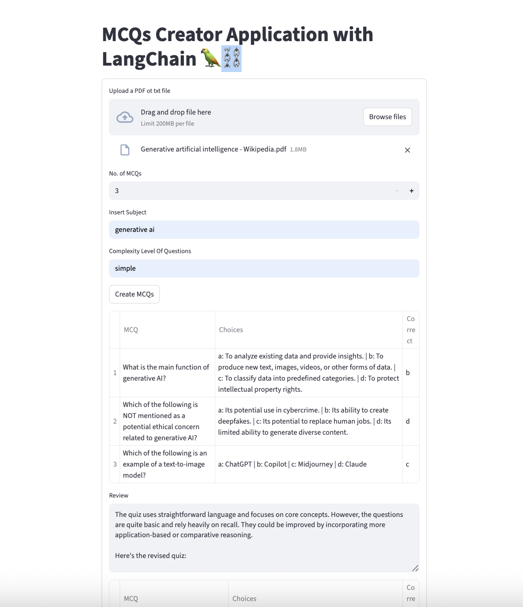

# MCQ Generator

An intelligent Multiple Choice Question (MCQ) generator that creates tailored quiz questions from input text using advanced NLP techniques and machine learning models.

> **Tutorial Credit**: This project was built following the comprehensive tutorial by [Krish Naik, Sunny Savita, and Boktiar Ahmed Bappy.](https://www.youtube.com/watch?v=mEsleV16qdo&t=1662s) - "End To End MCQ Generator LLM App Using Langchain,OpenAI,Streamlit"

## 🌟 Features

- **Text-to-MCQ Generation**: Convert any text content into multiple choice questions
- **File Upload Support**: Process PDF or TXT files
- **Customizable Parameters**:
  - Number of questions
  - Subject/topic specification
  - Difficulty level adjustment
  - Question complexity control
- **Interactive Web Interface**: User-friendly Streamlit-based GUI
- **Real-time Generation**: Fast MCQ creation with immediate results

## 🚀 Demo



## 📋 Prerequisites

- Python 3.8 or higher
- pip package manager
- Gemini API key

## 🔧 Installation

1. **Clone the repository**

   ```bash
   git clone https://github.com/ujadhav25/mcq_generator.git
   cd mcq_generator
   ```

2. **Create a virtual environment**

   ```bash
   python -m venv venv
   source venv/bin/activate  # On Windows: venv\Scripts\activate
   ```

3. **Install dependencies**

   ```bash
   pip install -r requirements.txt
   ```

4. **Set up environment variables**
   Create a `.env` file in the root directory:
   ```env
   GEMINI_API_KEY=your_openai_api_key_here
   # Add other API keys as needed
   ```

## 🎯 Usage

### Running the Application

1. **Start the Streamlit app**

   ```bash
   streamlit run StreamlitApp.py
   ```

2. **Access the web interface**
   Open your browser and navigate to `http://localhost:8501`

### Using the MCQ Generator

1. **Upload Content**

   - Upload a PDF or TXT file

2. **Configure Parameters**

   - Select number of questions (1-50)
   - Choose subject/topic
   - Set difficulty level (Easy/Medium/Hard)
   - Adjust question complexity

3. **Generate MCQs**

   - Click "Generate MCQs" button
   - Wait for processing to complete
   - Review generated questions

4. **Export Results**
   - Download as PDF, CSV, or JSON
   - Copy to clipboard for immediate use

### Command Line Usage

```bash
python mcq_generator.py --input "path/to/file.txt" --num_questions 10 --subject "Science" --tone "Medium"
```

## 🛠️ Configuration

### Environment Variables

| Variable         | Description                   | Required |
| ---------------- | ----------------------------- | -------- |
| `GEMINI_API_KEY` | Gemini API key for GPT models | Yes      |

## 🔍 How It Works

1. **Text Processing**: Input text is cleaned and preprocessed
2. **Content Analysis**: Key concepts and topics are identified
3. **Question Generation**: AI models create relevant MCQs
4. **Answer Validation**: Generated options are verified for accuracy
5. **Formatting**: Questions are formatted for display

## 📊 Examples

### Input Text

```
Photosynthesis is the process by which plants convert light energy into chemical energy.
This process occurs in the chloroplasts of plant cells and requires sunlight, water, and carbon dioxide.
```

### Generated MCQ

**Question**: What is the primary function of photosynthesis?

- A) To produce oxygen for animals
- B) To convert light energy into chemical energy ✓
- C) To absorb carbon dioxide from air
- D) To create water in plants

## 🤝 Contributing

We welcome contributions! Please follow these steps:

1. Fork the repository
2. Create a feature branch (`git checkout -b feature/amazing-feature`)
3. Commit your changes (`git commit -m 'Add amazing feature'`)
4. Push to the branch (`git push origin feature/amazing-feature`)
5. Open a Pull Request

### Development Guidelines

- Update documentation as needed
- Ensure compatibility with Python 3.8+

## 🗺️ Roadmap

- [ ] Support for more file formats (EPUB, HTML)
- [ ] Multi-language MCQ generation
- [ ] Advanced analytics and question insights
- [ ] Integration with Learning Management Systems
- [ ] Batch processing capabilities
- [ ] Question difficulty scoring algorithm

## 📞 Support

If you encounter any issues or have questions:

1. Check the [Issues](https://github.com/ujadhav25/mcq_generator/issues) page
2. Create a new issue if your problem isn't already reported
3. Contact: [your-email@example.com](mailto:ujadhav25@gmail.com)

## 🙏 Acknowledgments

- Gemini API for providing powerful language models
- Streamlit team for the amazing web app framework
- The open-source community for various NLP libraries

## 📈 Performance

- **Average generation time**: 2-5 seconds per question
- **Supported file size**: Up to 10MB
- **Concurrent users**: Up to 100 (depends on hosting)
- **Question accuracy**: ~85-90% based on user feedback

---

**Made with ❤️ by [Umesh Jadhav]**

_Star ⭐ this repository if you find it helpful!_
